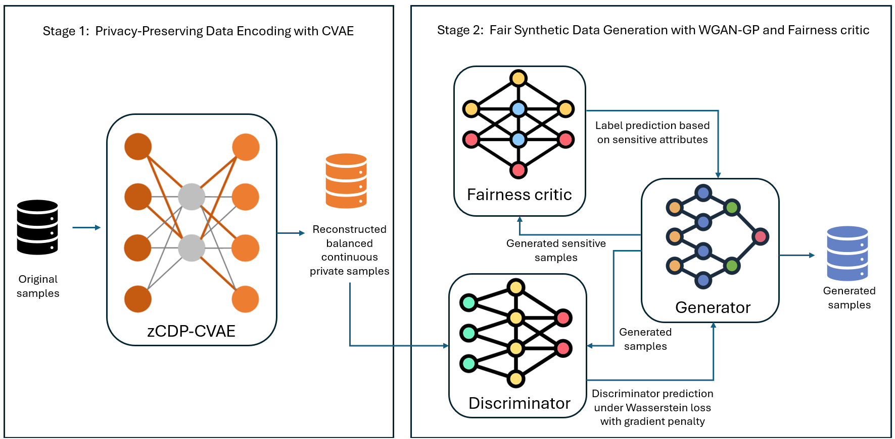

# SF-GAN

## Fair and Privacy-Aware Synthetic Tabular Data Generation

SF-GAN is a hybrid generative framework designed to generate realistic synthetic tabular healthcare data while jointly considering **data utility**, **privacy**, and **fairness**.



The framework integrates:

- A **Conditional Variational Autoencoder (CVAE)** for learning class-conditional representations of mixed-type tabular data.
- **zero-Concentrated Differential Privacy (zCDP)** during CVAE training.
- A **Wasserstein Generative Adversarial Network with Gradient Penalty (WGAN-GP)** for improving sample realism and diversity.
- An adversarial **fairness critic** for reducing information about sensitive attributes in generated samples.

The repository contains implementations for five healthcare benchmark datasets.

---

## Architecture Overview

SF-GAN follows a two-stage generative pipeline.

### Stage 1: Privacy-aware CVAE

The Conditional Variational Autoencoder learns a structured latent representation of the original data. Both the encoder and decoder are conditioned on the target class, allowing the model to account for class imbalance and generate class-dependent observations.

The reconstruction objective treats the input variables according to their type:

- Mean squared error is used for continuous variables.
- Binary cross-entropy is used for binary variables.
- The Kullback–Leibler divergence regularizes the latent distribution.


Class weights are applied when the proportion of the majority class exceeds `0.60`.

During CVAE optimization, gradients are clipped and Gaussian noise is added according to the zCDP privacy parameter \(\rho\). Privacy accounting is implemented separately in each dataset directory through `zcdp_accountant.py`.

### Stage 2: Fair WGAN-GP

The reconstructed private representations produced by the CVAE are passed to a WGAN-GP composed of:

- A generator that produces synthetic tabular observations.
- A Wasserstein critic that distinguishes reconstructed observations from generated observations.
- A fairness critic that attempts to recover the sensitive attribute from generated samples.


The fairness critic minimizes a cross-entropy classification loss. Conversely, the generator is encouraged to make the sensitive attribute difficult to predict. This adversarial objective encourages the generation of realistic observations while reducing dependence between generated outcomes and the selected sensitive attribute.

---

## Repository Structure

```text
SF_GAN_U_code/
├── Data/
│   └── Readme.md
│
├── Dataset_1/
│   ├── Architecture.py
│   ├── reconstructed_cancer.csv
│   └── zcdp_accountant.py
│
├── Dataset_2/
│   ├── Architecture.py
│   ├── diabetes_preprocessed.csv
│   └── zcdp_accountant.py
│
├── Dataset_3/
│   ├── Architecture.py
│   ├── cardio_data_preprocessed.csv
│   └── zcdp_accountant.py
│
├── Dataset_4/
│   ├── Architecture.py
│   ├── Regensburg_Pediatric_Preprocessed.csv
│   └── zcdp_accountant.py
│
├── Dataset_5/
│   ├── Architecture.py
│   ├── preprocessed_az.csv
│   └── zcdp_accountant.py
│
├── Figures/
├── README.md
└── Requirements.txt
```

Each dataset directory contains:

- `Architecture.py`: the complete SF-GAN training, generation, and evaluation pipeline.
- `zcdp_accountant.py`: the zCDP privacy-accounting utilities.
- The expected preprocessed CSV filename used by the corresponding implementation.

---

## Benchmark Datasets

The experiments were conducted on five publicly available healthcare datasets covering different clinical prediction tasks, sample sizes, feature types, and levels of class imbalance.

Together, these datasets provide a diverse benchmark for evaluating the utility, fairness, privacy, and statistical realism of synthetic tabular data.

| Directory | Dataset | Expected input file |
|---|---|---|
| `Dataset_1` | Cervical Cancer | `reconstructed_cancer.csv` |
| `Dataset_2` | Diabetes Indicators | `diabetes_preprocessed.csv` |
| `Dataset_3` | Cardiovascular Disease | `cardio_data_preprocessed.csv` |
| `Dataset_4` | Pediatric Appendicitis | `Regensburg_Pediatric_Preprocessed.csv` |
| `Dataset_5` | Alzheimer’s Disease | `preprocessed_az.csv` |

### Dataset Access

The benchmark datasets are not stored in this repository. Download the required files as described in [`Data/Readme.md`](Data/Readme.md).

After downloading and preprocessing the datasets, place each CSV file in its corresponding directory using the exact filename reported in the table above.

Please consult the original dataset sources for their respective licenses, terms of use, and citation requirements.

---

## Installation

### 1. Clone the Repository

```bash
git clone https://github.com/AdouaniMalek/SF_GAN_U.git
cd SF_GAN_U
```


```bash
cd SF_GAN_U_code
```

### 2. Create a Virtual Environment

Using `venv`:

```bash
python -m venv .venv
```

Activate the environment on Linux or macOS:

```bash
source .venv/bin/activate
```

Activate it on Windows PowerShell:

```powershell
.venv\Scripts\Activate.ps1
```

### 3. Install the Dependencies

```bash
python -m pip install --upgrade pip
pip install -r Requirements.txt
```

The main dependencies include:

- Python
- PyTorch
- NumPy
- pandas
- Matplotlib
- scikit-learn
- XGBoost

A CUDA-compatible GPU is recommended because each script executes multiple CVAE and WGAN-GP training procedures. If CUDA is unavailable, the implementation automatically uses the CPU.

---

## Configuration

Before running an experiment, open the corresponding `Architecture.py` file and verify `DATASET_DIR`.

The current Dataset 1 implementation contains an absolute local path:

```python
DATASET_DIR = "path_to_/SF_GAN_U/Dataset_1/"
```

For portability across operating systems and computers, replace it with:

```python
DATASET_DIR = os.path.dirname(os.path.abspath(__file__))
```

The model directory is created automatically:

```python
MODEL_DIR = os.path.join(DATASET_DIR, "models")
os.makedirs(MODEL_DIR, exist_ok=True)
```

Apply the same portable path configuration to the five `Architecture.py` files.

---

## Running the Experiments

Run all commands from the repository root.

### Cervical Cancer

```bash
python Dataset_1/Architecture.py
```

### Diabetes Indicators

```bash
python Dataset_2/Architecture.py
```

### Cardiovascular Disease

```bash
python Dataset_3/Architecture.py
```

### Pediatric Appendicitis

```bash
python Dataset_4/Architecture.py
```

### Alzheimer’s Disease

```bash
python Dataset_5/Architecture.py
```

On Windows, the `py` launcher can also be used:

```powershell
py Dataset_1\Architecture.py
```

Each `Architecture.py` file executes the complete experimental pipeline rather than only training one model. Depending on the dataset-specific implementation, this can include:

1. Loading and preprocessing the input CSV file.
2. Identifying binary and continuous variables.
3. Computing the zCDP privacy budget.
4. Training the privacy-aware CVAE.
5. Reconstructing the original observations.
6. Training the WGAN-GP and fairness critic.
7. Generating the final synthetic dataset.
8. Performing a privacy-budget sweep.
9. Running the ablation study.
10. Evaluating downstream utility.
11. Evaluating demographic parity.

## Architecture Details

### CVAE

The CVAE receives the complete feature vector and one class-conditioning value.

#### Encoder

```text
Input dimension: feature_dim + 1
    ↓
2048 → BatchNorm → LeakyReLU(0.2)
    ↓
1024 → BatchNorm → LeakyReLU(0.2)
    ↓
512 → BatchNorm → LeakyReLU(0.2)
    ↓
2 × latent_dim
```

The encoder output is divided into the latent mean \(\mu\) and log-variance \(\log \sigma^2\).

#### Decoder

```text
Input dimension: latent_dim + 1
    ↓
512 → BatchNorm → LeakyReLU(0.2)
    ↓
1024 → BatchNorm → LeakyReLU(0.2)
    ↓
2048 → BatchNorm → LeakyReLU(0.2)
    ↓
feature_dim → Sigmoid
```

### WGAN-GP Generator

```text
feature_dim
    ↓
256 → 512 → 1024 → 2048
    ↓
1024 → 512 → 256
    ↓
feature_dim → Sigmoid
```

Batch normalization and ReLU activation are applied to every hidden generator layer.

### Wasserstein Critic

```text
feature_dim
    ↓
1024 → 2048 → 1024 → 512
    ↓
256 → 512 → 1024
    ↓
1
```

LeakyReLU with a negative slope of `0.2` is applied to the hidden critic layers. No sigmoid activation is applied to the final Wasserstein score.

### Fairness Critic

```text
feature_dim
    ↓
1024 → 768 → 512 → 256 → 128
    ↓
3 age classes
```

LeakyReLU with a negative slope of `0.2` is applied to the hidden fairness-critic layers.

---

## Dataset 1 Hyperparameters

### General Optimization

| Hyperparameter | Code variable | Value |
|---|---|---:|
| Learning rate | `HYP_LR` | `0.0001` |
| Batch size | `HYP_BATCH_SIZE` | `64` |
| Adam first-moment coefficient | `HYP_B1` | `0.9` |
| Adam second-moment coefficient | `HYP_B2` | `0.999` |
| Weight decay | `HYP_WEIGHT_DECAY` | `0.001` |
| Random seed | `set_seed` | `42` |
| Data-loader workers | `num_workers` | `0` |
| Drop incomplete batch | `drop_last` | `True` |

### CVAE and Privacy

| Hyperparameter | Code variable | Value |
|---|---|---:|
| Latent dimension | `LATENT_DIM` | `14` |
| CVAE epochs | `CVAE_EPOCHS` | `200` |
| Maximum gradient norm | `MAX_GRAD_NORM` | `1.1` |
| Noise multiplier used by the accountant | `HYP_NOISE_MULTIPLIER` | `0.0001` |
| Privacy-accounting steps | `steps` | `100` |
| Target delta | `target_delta` | \(10^{-5}\) |
| Reconstruction privacy sweep | `RHO_VALUES` | `[0.05, 0.1, 0.2, 0.4, 0.8, 1.6]` |

The initial privacy parameter is calculated using:

```python
q = HYP_BATCH_SIZE / total_samples
rho = compute_zcdp(
    q,
    noise_multiplier=HYP_NOISE_MULTIPLIER,
    steps=100,
)
```

```python
epsilon, delta, _ = get_privacy_spent(
    rho,
    target_delta=1e-5,
)
```

### WGAN-GP and Fairness

| Hyperparameter | Code variable | Value |
|---|---|---:|
| WGAN-GP epochs | `WGAN_EPOCHS` | `500` |
| Gradient-penalty coefficient | `lambda_gp` | `10` |
| Generator L1 coefficient | `LAMBDA_L1` | `0.0001` |
| Wasserstein critic L1 coefficient | `LAMBDA_L1` | `0.0001` |
| Fairness critic L1 coefficient | `LAMBDA_L1_F` | `0.0001` |
| Fairness-loss coefficient | `LAMBDA_FAIR` | `0.5` |
| Sensitive attribute | — | `Age`, `Gender`, `Ethnicity` |
| Number of sensitive groups | `AGE_NUM_CLASSES`, `Gender Group`, `Ethnicity Group` | `5` |
| Progress-reporting interval | `SAMPLE_INTERVAL` | `1` |

A standard normal noise vector having the same dimension as the complete input feature vector is supplied to the generator.


## Ablation Study

The implementation evaluates three component-removal variants:

| Variant | Privacy | CVAE | Fairness critic |
|---|:---:|:---:|:---:|
| Full SF-GAN | ✓ | ✓ | ✓ |
| No Privacy | ✗ | ✓ | ✓ |
| No CVAE | — | ✗ | ✓ |
| No Fairness | ✓ | ✓ | ✗ |

These variants are used to study the contribution of the privacy mechanism, the CVAE representation, and the adversarial fairness component.


## Generated Files

Running an `Architecture.py` script creates a `models` directory inside the corresponding dataset directory.

For Dataset 1, the generated files include:

```text
Dataset_1/
├── models/
│   ├── ConditionalVAE_rho_<rho>.pth
│   ├── generator_ep500_rho_<rho>.pth
│   ├── discriminator_ep500_rho_<rho>.pth
│   ├── fairness_critic_ep500_rho_<rho>.pth
│   ├── cvae_sweep_rho_<rho>.pth
│   └── generator_<ablation_or_sweep_name>_rho_<rho>.pth
│
├── recons_samp_rho_<rho>.csv
├── generated_samples_rho_<rho>.csv
├── rho_sweep_results.csv
├── utility_auroc_auprc_rho_sweep.csv
├── fairness_dpd_rho_sweep.csv
├── ablation_auroc_auprc_comparison.csv
├── ablation_dpd_comparison.csv
├── privacy_utility_tradeoff.png
├── utility_auroc_sweep.png
├── utility_auprc_sweep.png
├── utility_auroc_violin.png
├── utility_auprc_violin.png
├── fairness_dpd_sweep.png
├── fairness_dpd_violin.png
├── privacy_utility_fairness_joint.png
├── ablation_loss_curves.png
├── ablation_auroc_bar.png
├── ablation_auprc_bar.png
└── ablation_dpd_bar.png
```

The exact filenames include the privacy parameter used during the corresponding experiment.

---

## Reproducibility

For reproducible experiments:

1. Use the dependency versions recorded in `Requirements.txt`.
2. Preserve the exact preprocessed input files described in `Data/Readme.md`.
3. Record the train/test partitions used for each evaluation setting.
4. Retain the default seed or document any alternative seeds.
5. Report the mean and standard deviation over all 30 evaluation runs.
6. Record the Python, PyTorch, CUDA, and GPU versions used for the experiments.

The implementation initializes NumPy and PyTorch using seed `42`. Evaluation runs subsequently use consecutive seeds beginning at `0`.

Complete numerical reproducibility can still depend on the hardware, CUDA version, and PyTorch operations used.

---

## Methodological References

SF-GAN builds upon the following methodological foundations:

1. Sohn, K., Lee, H., and Yan, X. “Learning Structured Output Representation using Deep Conditional Generative Models.” *Advances in Neural Information Processing Systems*, 2015. [Paper](https://proceedings.neurips.cc/paper/2015/hash/8d55a249e6baa5c06772297520da2051-Abstract.html)

2. Gulrajani, I., Ahmed, F., Arjovsky, M., Dumoulin, V., and Courville, A. “Improved Training of Wasserstein GANs.” *Advances in Neural Information Processing Systems*, 2017. [Paper](https://proceedings.neurips.cc/paper/2017/hash/892c3b1c6dccd52936e27cbd0ff683d6-Abstract.html)

3. Bun, M. and Steinke, T. “Concentrated Differential Privacy: Simplifications, Extensions, and Lower Bounds.” *Theory of Cryptography Conference*, 2016. [Paper](https://doi.org/10.1007/978-3-662-53641-4_24)

4. Louppe, G., Kagan, M., and Cranmer, K. “Learning to Pivot with Adversarial Networks.” *Advances in Neural Information Processing Systems*, 2017. [Paper](https://proceedings.neurips.cc/paper/2017/hash/48ab2f9b45957ab574cf005eb8a76760-Abstract.html)

---


## Acknowledgements

This work is supported by the European Union’s Horizon Europe Programme under the Marie Skłodowska-Curie Actions, Grant No. 101236749, the France 2030 programme (ANR-18-RHUS-0004; ANR-23-IAHU-0004), the iRECORDS project (JTC_2021), and the French Programme Investissement d’Avenir (I-SITE ULNE ANR-16-IDEX-0004; ARCHIE-INFINITE n°I-KUL-22-005), as well as Inserm and the French Ministry of Health (MESSIDORE 2023, IReSP AAP-2023-MSDR-341423).

---
